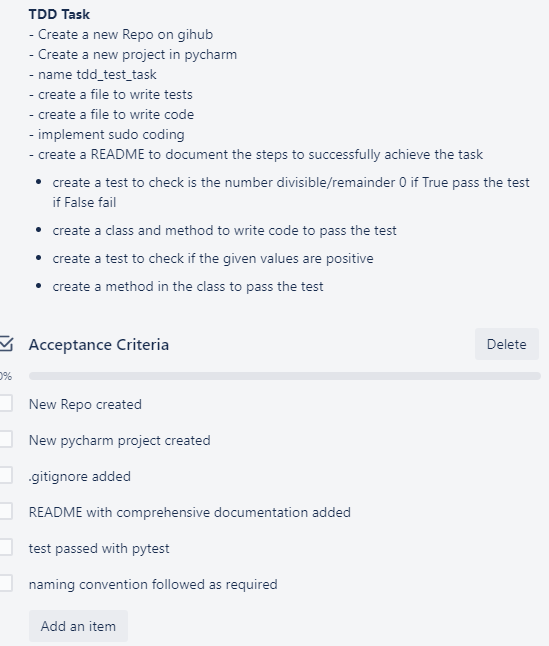
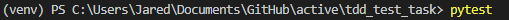
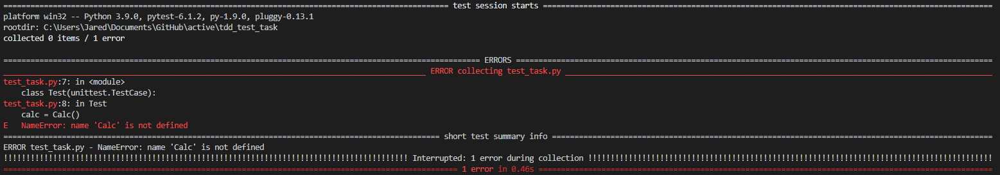
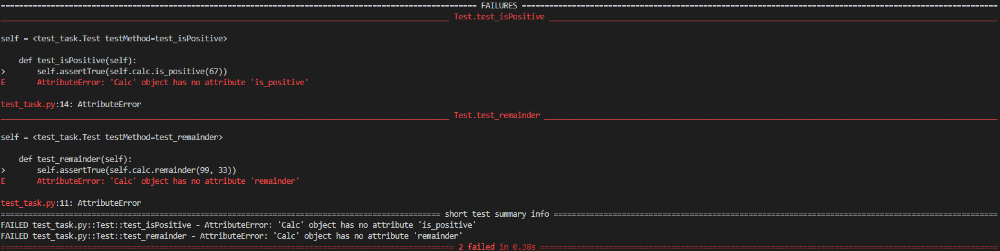
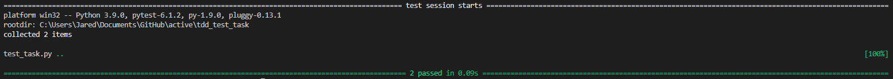

# Task 1



**Explanation**
1. One should create the testing file first and then write the code to test

<br>

2. For the testing framework to know which files to test, you must preface the file name with ```test_```

<br>


3. We create a file called ```test_task.py``` and import the following:
    ```python
    import pytest
    import unittest
    ```

<br>


4. Then create a class, inheriting the ```unittest.TestCase```
    ```python
    # This creates the test class
    class Test(unittest.TestCase):
        calc = Calc()

        # This will fail if the given assert doesn't return True
        def test_remainder(self):
            self.assertTrue(self.calc.remainder(99, 33))

        # This will fail if the given assert doesn't return True
        def test_isPositive(self):
            self.assertTrue(self.calc.is_positive(67))
    ```
<br>

5. This gives us the idea to create a file containing a class named ```Calc``` which contains class methods called ```remainder``` and ```is_positive```
    - ```remainder``` should take in two numbers and return True or False
    - ```is_positive``` should take in one number and return True or False

<br>

6. I run the test initially with ```pytest``` in terminal:


<br>

7. I get the following result:


<br>

8. As shown, there is no class called ```Calc()``` -- we must create a new file, create a class called Calc and finally import it into our test file

<br>

9. Name the file as ```task.py``` and write the required functionality:
```python
class Calc:
    pass
```

<br>

10. If we run ```pytest``` again we have another problem: the class does not have the required methods


<br>

11. So we must type these methods:
```python
class Calc:
    # Returns T/F if the value is positive
    def is_positive(self, value):
        if value > 0:
            return True
        return False

    # Returns T/F if the num1 is divisible by num2
    def remainder(self, num1, num2):
        if num1 % num2 == 0:
            return True
        return False
```
<br>

12. Now if we run ```pytest``` in terminal again:

